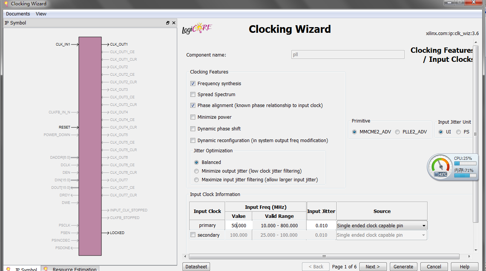

# 跑马灯实验

## 设计目的
通过逻辑设计实现LED灯的控制。

## 设计任务
通过逻辑设计实现跑马灯，按下开始按钮后，8个LED灯依次点亮，每次点亮时间为1s，按下停止按钮后，跑马灯停止。

## 逻辑设计
跑马灯时钟频率为10MHz，设计中每个LED灯点亮时间为1s，通过24bit的计数器实现，计数器范围0~9999999，当计数到9999999时，时长为1s。定义了一个8bit寄存器led_dout初始值为00000001，当按下开始按键SW7时，计数器开始工作，当计数到9999999时，寄存器左移一位并将最高位移到最低位，实现LED灯依次点亮，当按下停止按键SW4，计数器停止工作，寄存器的值保持不变，跑马灯停止。

实验中设计分为两个模块：light_flow_clk_rst与light_flow。
a)	light_flow_clk_rst模块：产生设计所需要的时钟与复位。
b)	light_flow模块：跑马灯控制模块，每1s跳变一次，当按下开始按钮后开始跳变，按下停止按钮后，跑马灯停止跳变。
 
## 设计步骤如下：
1)	打开ISE Design Suite 14.6，点击File→New Project名称为light_flow，点击Next；

2)	点击Next，出现如下界面：Family、Device、Package、Speed为所用FPGA型号，选择如图所示，点击next然后点击Finish；
 
3)	在如图所示位置右击鼠标，单击New Source；
 
4)	选择VHDL Module，在右侧选择文件路径以及文件名称light_flow_clk_rst，点击Next；
 

5)	在如下界面可以对文件light_flow_clk_rst进行编辑；
 
6)	FPGA的外部晶振时钟为50MHz，设计中所用时钟为10MHz，需要例化PLL锁相环IP核，重复第4步，然后选择IP(CORE Generator & Architecture Wizard)；
 

7)	选择IP核的类型：选择FPGA Features and Design→Clocking→Clocking Wizard；
 
8)	Input Freq的value值为外部晶振的时钟，填写50M，其他值为默认，点击Next；
 
9)	CLK_OUT1为PLL输出的时钟，即设计中所使用时钟，填写10MHz，点击Next；
 
10)	勾选RESET与LOCKED，其中RESET为PLL的高有效复位信号，LOCKED为输出时钟有效信号，高有效。点击Generate生成IP核；
 
11)	利用上述相同方法生成light_flow.vhd与light_flow_top.vhd模块；

12)	添加时钟约束，语法如下：
NET "I_sys_clk_50M" TNM_NET = I_sys_clk_50M;
TIMESPEC TS_I_sys_clk_50M = PERIOD "I_sys_clk_50M" 20 ns HIGH 50%;
NET "I_sys_clk_50M"     LOC = AA7    |   IOSTANDARD = LVCMOS33;  
其中I_sys_clk_50M为时钟信号名称，20ns为时钟周期，50%为时钟占空比，
LOC = AA7为对应的FPGA管脚，IOSTANDARD = LVCMOS33为AA7管脚的电平；

13)	添加管脚约束，语法如下：
NET  aaaa     LOC = bbbb   |   IOSTANDARD = cccc;
aaaa：信号名称，bbbb：信号对应FPGA的管脚，cccc为管脚对应电平。实验中的约束通过查看电路原理图得到，具体的约束文件为工程里的light_flow.ucf。

## 实验内容与步骤
1)	打开ISE Design Suite 14.6软件，点击“File→Open Project”，选择工程目录下temp_sensor文件夹中的light_flow.xise，点击打开即可打开工程；
 
2)	需要清空综合和实现过程所产生的文件，单击Cleanup Project Files，然后点击OK； 
 
3)	双击Generate Programming File，生成下载到FPGA的bit文件；
 
4)	等待几分钟后出现如下界面，生成bit文件文件；
 
5)	点击Configure Target Device，双击Boundary Scan，然后在右侧空白处右击鼠标后，单击Initialize Chain；
 
6)	将鼠标放在xc7z020 bypss上，右击鼠标后单击Assign New Configuration File，选择light_flow_top.bit，然后点击打开；
 

7)	将鼠标放在xc7z020 bypss上，右击鼠标后单击Program；
 
8)	等到弹出如下对话框时，表明程序下载成功；
 
9)	KEY1为复位信号，当按下KEY1时，八个LED灯只有LED1点亮。PL_SW0为跑马灯开始按键，按下后跑马灯开始工作。PL_SW1为跑马灯暂停，按下后跑马灯暂停变化。
